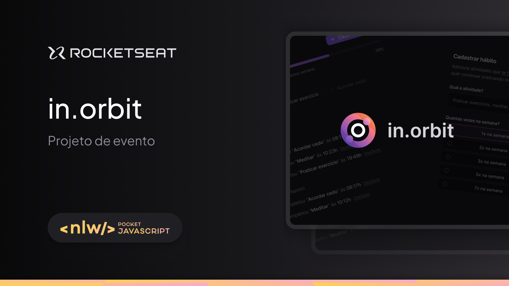

# Backend API - NLW Pocket: Full-stack Intermediário

**Descrição:**
No back-end, trabalhei com Node.js aplicando os conceitos de API REST, além de explorar TypeScript, o framework Fastify, integração com DrizzleORM e PostgreSQL, e conteinerização com Docker. Também pude validar dados com Zod.

**Tecnologias:**
* NodeJS
* Fastify
* PostgreSQL
* DrizzleORM
* Docker
* Zod

## 👨‍💻 Colaboradores

<table>
    <tr>
         <td align="center"><a href="https://brunogoncalvesferreira.com"> <b>Bruno Gonçalves</b></a> <a href="https://brunogoncalvesferreira.com" title="Bruno Gonçalves Ferreira">👨‍🚀</a></td>
    </tr>
</table>